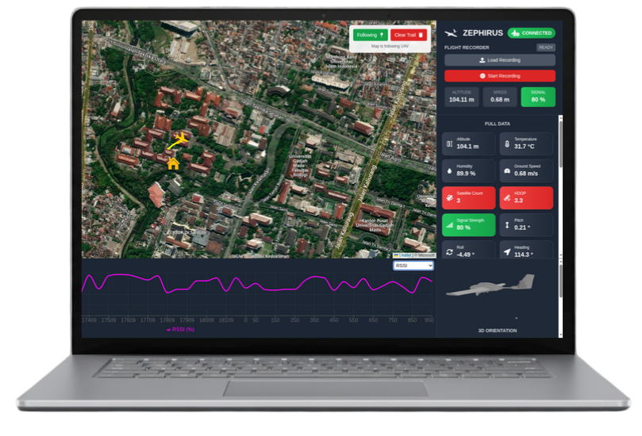
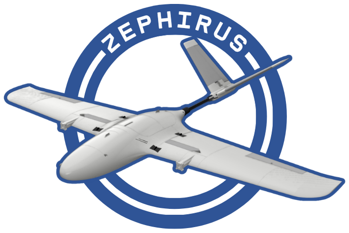

# Ground Control Station (GCS) for ZEPHIRUS


This is the repository for the Ground Control Station (GCS) of ZEPHIRUS (Zero Emission PoC for Humidifier-Induced Rain UAV System).\

## Setup
1. Clone the repository <br>
```bash
git clone git@github.com:sulaimanfawwazak/Capstone-ZEPHIRUS-GCS.git
```

2. Go to the repository <br>
```bash
cd Capstone-ZEPHIRUS-GCS
```

3. Install the dependencies <br>
```bash
npm install
```

## Run The GCS <br>
- Run Both Frontend and Backend Simulataneously<br>
   - Production:
    ```bash
    tools/run-gcs-prod.sh
    ```
   - Development:
    ```bash
    tools/run-gcs-dev.sh
    ```
- Run Just The Frontend or Just The Backend<br>
Use `--frontend` or `--backend` flag <br>
  - Production:
    ```bash
    tools/run-gcs-prod.sh --frontend
    ```
    or
    ```bash
    tools/run-gcs-prod.sh --backend
    ```
  - Development:
    ```bash
    tools/run-gcs-dev.sh --frontend
    ```
    or 
    ```bash
    tools/run-gcs-dev.sh --backend
    ```
- Manually Run Frontend or Backend
  - Frontend (development):
  ```bash
  npm run dev
  ```
  - Frontend (production)
  ```bash
  npm start
  ```
  - Backend (development & production):
  ```bash
  node server/websocket-server.js
  ```

> To run the production script, you need to run `npm run start` first to compile the frontend.

## Simulate UAV Data Using ESP32
<br>

You can simulate the UAV data being transmitted from the UAV and received by the ground receiver and connected to the laptop using these steps:
- Connect an ESP32 to your laptop using data cable
- Open Arduino IDE and copy & paste code inside the `tools/simulate-flight-data.ino`
- Upload the code to the ESP32
- Run the GCS just like on the 3rd step
- Optionally you can hit the `RESET` button on the ESP32 or replug the ESP32 to your laptop to simulate the data from the start.

